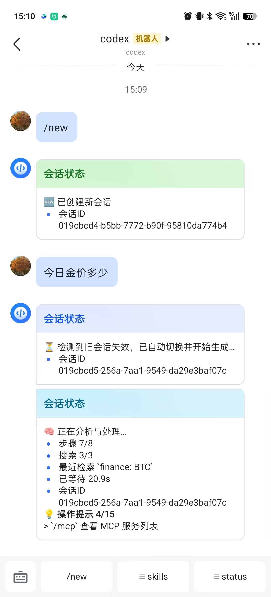
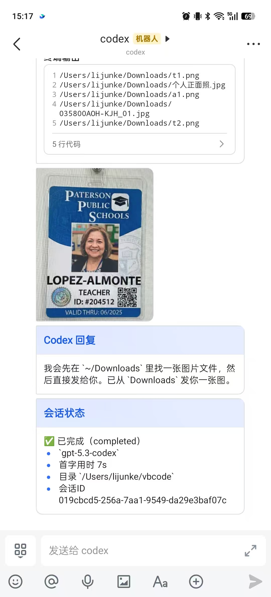
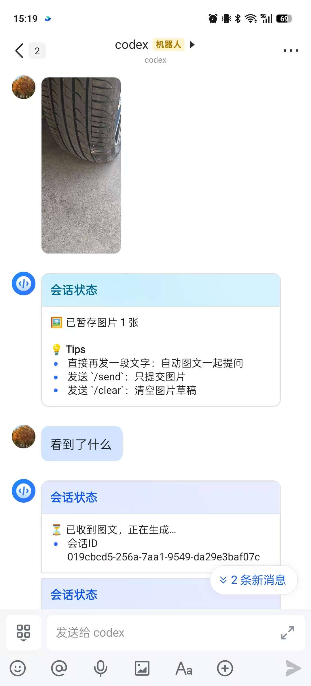

# codex-feishu

Codex remote access, straight from Feishu. Use Codex from terminal or Feishu with shared conversation context.

## Chinese docs

- 中文文档（安装、命令、架构、限制）：[docs/README.zh-CN.md](docs/README.zh-CN.md)

## What it does

- No Codex core patching.
- `codex-feishu init` writes MCP config + bridge config.
- `codex-feishu daemon` bridges:
  - Feishu text/image -> Codex
  - Codex streaming output -> Feishu cards/text
  - approvals / request_user_input -> Feishu quick actions
- per-chat mapping for `thread_id` and `cwd`.
- private/group chat auto-bind (bind code is optional fallback).

## Preview

Feishu side experience snapshots:

<table>
  <tr>
    <td align="center">
      <a href="docs/assets/feishu-preview-session.png">
        
      </a>
      <br />
      Session status
    </td>
    <td align="center">
      <a href="docs/assets/feishu-preview-image-reply.png">
        
      </a>
      <br />
      Image + reply flow
    </td>
    <td align="center">
      <a href="docs/assets/feishu-preview-image-reply1.jpg">
        
      </a>
      <br />
      Image + reply flow v2
    </td>
  </tr>
</table>


## Install

```bash
npm i -g @openai/codex  #安装codex(如果已安装可以跳过)

npm i -g @openai-lite/codex-feishu
```

## Quick start (macOS / Linux)

```bash
codex-feishu init --app-id <FEISHU_APP_ID> --app-secret <FEISHU_APP_SECRET> daemon
```

Notes:
- `init ... daemon` restarts daemon in background.
- Daemon is treated as singleton; `init ... daemon` will stop previous daemon instances first.
- Binding is automatic for private and group chats. QR/bind payloads are optional fallback only.

## Quick start (Windows)

```powershell
npm i -g @openai-lite/codex-feishu
codex-feishu init --app-id <FEISHU_APP_ID> --app-secret <FEISHU_APP_SECRET> daemon
```

Windows defaults:
- RPC endpoint: `tcp://127.0.0.1:9765`
- You can override with `CODEX_FEISHU_RPC_ENDPOINT`.

Optional checks:

```bash
codex-feishu doctor
codex
```

## Feishu setup

- 设置清单（中文）: [docs/FEISHU_SETUP.zh-CN.md](docs/FEISHU_SETUP.zh-CN.md)

## CLI commands

- `codex-feishu init [flags] [daemon|--daemon]`
- `codex-feishu doctor`
- `codex-feishu daemon`
- `codex-feishu down`
- `codex-feishu uninstall`
- `codex-feishu qrcode [--purpose <text>] [--ascii] [--json]`
- `codex-feishu inbound --chat-id <id> --text <msg> [--user-id <id>]`
- `codex-feishu mcp` (internal MCP entry, normally no manual use)

Daemon control:
- `codex-feishu down` : stop/pause the local daemon (bridge stops relaying)
- `codex-feishu uninstall` : stop daemon and remove managed bridge config

## Feishu commands

Core:
- `/status`: show current chat status
- `/help`: show command help
- `/group`: show group-chat usage guide
- `/new`: create and switch to a new thread
- `/stop`: stop current generation
- `/pending`: list pending approvals/input requests

Codex capability bridge:
- `/review [instructions|branch:<name>|commit:<sha>]`
- `/compact`
- `/model [list|clear|<model_id>]`
- `/approvals [untrusted|on-failure|on-request|never]`
- `/permissions [read-only|workspace-write|danger-full-access]`
- `/plan [on|off|toggle]` (compat mode)
- `/init` (create/complete `AGENTS.md` through Codex)
- `/skills`
- `/mcp [list|get|add|remove|login|logout] ...`

Session / directory:
- `/resume [index|thread_id]`
- `/fork [index|thread_id]` (requires Codex app-server support; otherwise returns “not supported”)
- `/threads`
- `/sw <index|thread_id>`
- `/cwd`
- `/cwd <PATH>`
- `/cwd <PATH> new`

Approval responses:
- quick reply `1` / `2` / `3`
- `/approve [pending_id] [session]`
- `/deny [pending_id]`
- `/cancel [pending_id]`
- `/answer <pending_id> <text|json>`

## Behavior notes

- `/mcp` output is intentionally raw passthrough from native `codex mcp ...` (often code-block/table style).
- If mapped thread is invalid, daemon auto-recovers by creating a new thread and retrying once.
- Feishu and terminal are state-synced, but rendering is not pixel-identical.

## Runtime files

- `~/.codex/config.toml` (MCP server block)
- `~/.codex-feishu/config.json`
- `~/.codex-feishu/state.json`
- `~/.codex-feishu/run/daemon.pid`
- `~/.codex-feishu/run/daemon.log`

## Architecture and plan

- Architecture: [docs/ARCHITECTURE.md](docs/ARCHITECTURE.md)
- Thin bridge redesign: [docs/THIN_BRIDGE_ARCHITECTURE.md](docs/THIN_BRIDGE_ARCHITECTURE.md)
- Priority plan: [docs/PRIORITY_PLAN.md](docs/PRIORITY_PLAN.md)
