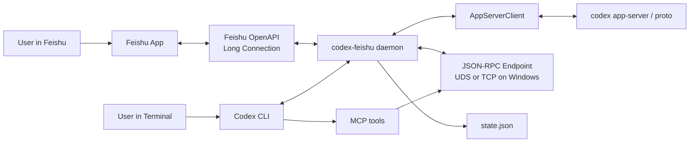
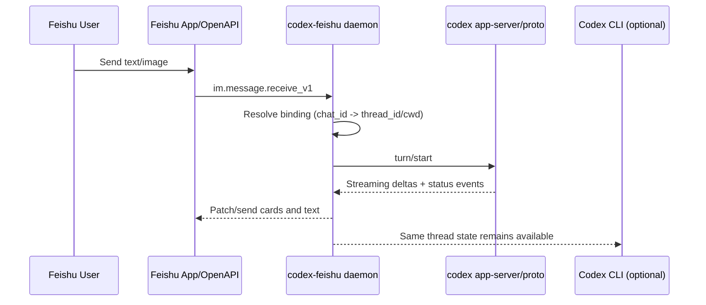

# codex-feishu Architecture

## Scope

- Keep Codex as the main runtime.
- Do not patch Codex core.
- Bridge Feishu <-> Codex via daemon and stable interfaces.

## Topology

```text
Feishu Client <-> Feishu OpenAPI (long connection)
                     |
                     v
               codex-feishu daemon
                 |            |
                 |            +-- state.json (binding/thread/cwd/pending)
                 |
                 +-- AppServerClient <-> codex app-server / codex proto
                 |
                 +-- JSON-RPC endpoint (UDS or TCP on Windows)
                         ^
                         |
                     Codex MCP
```

## System diagram



## Request/response flow (one question)



## Components

- `codex-feishu daemon`
  - Handles binding, per-chat thread/cwd mapping, message relay, approval relay.
  - Exposes RPC methods under `feishu/*` and `bridge/*`.
- `FeishuBridge`
  - Long-connection event/message receiver and sender.
- `AppServerClient`
  - Prefers `codex app-server`; degrades to `codex proto` when needed.
- MCP server (`codex-feishu mcp`)
  - Exposes tools to Codex side (`feishu_qrcode`, `feishu_status`, `feishu_new_thread`).

## Data model (persisted)

- `bindings[chat_id]`
  - `active_thread_id`, `active_cwd`
  - per-chat preferences: `preferred_model`, `approval_policy`, `sandbox_mode`, `plan_mode`
- `pending_bind_codes`
- `thread_titles`
- `active_thread_id`

`thread_buffers` and recent streaming caches are runtime-only and not fully persisted.

## Main flows

### 1) Bind

1. Generate bind payload (`feishu/qrcode`).
2. User sends `/bind CODE` (or private-chat auto-bind).
3. Daemon stores `chat_id -> thread/cwd` mapping.

### 2) User message

1. Feishu message enters daemon (`feishu/inbound_text` / `feishu/inbound_image`).
2. Daemon resolves mapped thread/cwd and per-chat overrides.
3. Daemon starts turn via app-server/proto.
4. Streaming events are relayed back to Feishu cards/messages.

### 3) Approval

1. Codex emits approval or request_user_input.
2. Daemon stores pending item and sends action hints to Feishu.
3. Feishu quick reply (`1/2/3` or explicit command) resolves pending item.
4. First valid reply wins.

## Compatibility strategy

- Treat Codex as evolving upstream.
- Prefer passthrough behavior when possible (`/mcp`, `/skills` style).
- Keep custom adapter logic minimal and isolated in daemon RPC handlers.
- For unsupported app-server methods, return explicit downgrade message or fallback path.

## Known tradeoffs

- Terminal and Feishu are state-consistent, but rendering cannot be pixel-identical.
- Some TUI-only commands have no strict app-server equivalent; daemon uses compatibility mode where possible.
